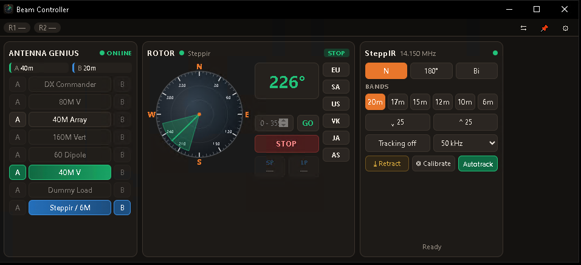
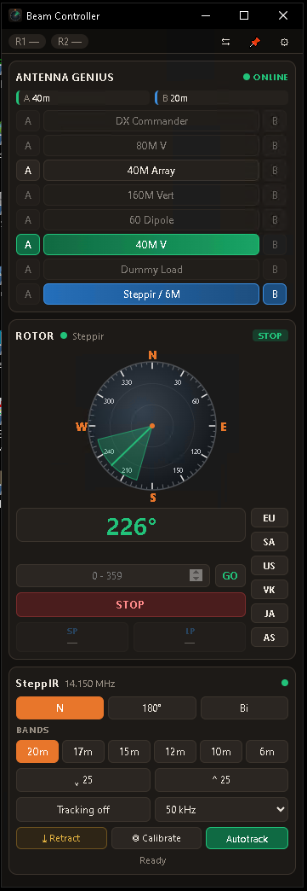

# Beam Controller

A compact Windows app that controls a **4O3A Rotator Genius**, a **SteppIR SDA100**
(through a TCP-to-RS232 converter) and a **4O3A Antenna Genius** from one window,
and takes beam headings and radio frequencies from **N1MM Logger+** during a contest.

Written in Go with [Wails](https://wails.io); the window is plain HTML/CSS/JS in
`frontend/dist`.





The **⇆** button switches to a narrow vertical layout that sits beside N1MM's windows.

<br clear="right">

## Running it

The program is built to:

```
%LOCALAPPDATA%\Programs\BeamController\BeamController.exe
```

Pin it to the taskbar or make a shortcut. Click **⚙** to enter the IP address and port
of each device, then **Save**. Settings and a log file are kept in
`%APPDATA%\BeamController\` (`config.json`, `beamcontroller.log`).

Toolbar buttons: **⇆** switches between the horizontal and vertical layout, **📌** keeps
the window on top of N1MM, **⚙** opens settings and the log.

## What each panel does

**Rotor**: click anywhere on the compass to turn there, type a heading and press GO or Enter,
or use the preset buttons (edit them in settings). **SP** and **LP** show the last heading N1MM
asked for, along with its long-path reciprocal; click either one to turn there.

**SteppIR**: N / 180° / Bi (plus ¾λ for verticals if enabled), band buttons, step up/down,
Retract, Calibrate, and the controller's Autotrack on/off. **Tracking** makes the SteppIR follow
the N1MM radio frequency. It retunes when the radio moves more than the selected kHz
or changes band.
**Elements never move while the controlling radio is transmitting.** A frequency change is
held and sent as soon as transmit ends.

**Antenna Genius**: one row per antenna with an **A** and a **B** button for the two radios (SO2R).
Green shows radio A's antenna, blue shows radio B's, and red means that radio is transmitting.
Antennas not allowed on a port's current band are greyed out.
If this PC is on a different subnet from the AG, the AG treats it as a remote connection and
asks for its **remote access code**. Enter that code in Settings (it is set in the AG's own network setup). The AG keeps its own
band-based automatic selection. A manual pick holds until the next band change.

## N1MM Logger+ setup

In N1MM: **Config ▸ Configure Ports, Mode Control… ▸ Broadcast Data**

* tick **Radio** and send to `127.0.0.1:12060`
* send rotor commands to `127.0.0.1:12040`

If those ports are already used by something else (e.g. the old Node-RED flow listened on
12041), change the ports in Beam Controller's settings to match. The Log tab shows an error if a port
is already in use.

**Follow radio** (SteppIR settings) picks which N1MM radio the SteppIR tracks: radio 1, radio 2,
the active (TX) radio, or *Radio with SteppIR on AG*, which follows whichever AG port
currently has the SteppIR antenna selected. That last option suits SO2R; set
*SteppIR antenna on AG* to the right AG antenna.

## Building

You need [Go](https://go.dev/dl/) 1.22 or newer and the WebView2 runtime (built into Windows 11).

Double-click **`build.bat`**. It installs the Wails build tool the first time, runs the tests,
builds the app, and opens the folder containing the new `BeamController.exe`.

It builds in a copy under `%TEMP%`, so it also works if the source folder is protected by
Windows Defender **Controlled folder access** (e.g. inside Documents).

## Adding your own features with Claude Code

This app was written with [Claude Code](https://claude.com/claude-code), Anthropic's AI coding
assistant, by a ham who doesn't consider himself a programmer. You can extend it the same way.
Describe what you want in plain English, and Claude Code reads the source, makes the change,
builds it and runs the tests.

1. **Fork** this repository on GitHub (the *Fork* button, top right) so you have your own copy.
2. **Clone** your fork to your PC, e.g. `git clone https://github.com/<your-call>/N1MM-BeamController`.
   Keep it out of `Documents` if Windows Controlled folder access is on.
3. **Install Claude Code** (desktop app or `npm install -g @anthropic-ai/claude-code`) and open the
   cloned folder in it.
4. **Ask for what you want.** For example:
   * "Add a button that turns the beam to long path of the last N1MM heading and holds it there."
   * "Support a second Rotator Genius for my 40 m beam, as a second compass."
   * "Add Stream Deck control: listen for HTTP requests like /rotor/220 and /steppir/180."
   * "My controller is a SteppIR SDA2000. Check the protocol differences and adapt steppir.go."
   * "Make the band buttons bigger and add 60 m."
5. Run **`build.bat`** to build and test, then try it on the air.
6. Commit and push to your fork. If the feature would help others, open a **pull request**
   back to this repository.

Tips:

* Tell Claude Code your station details: device models, IP addresses, firmware versions, and
  SO2R or single radio. Paste lines from the app's **Log** tab when something doesn't work.
  Most fixes in this project came from a pasted log or a captured raw device reply.
* Ask it to test with read-only commands or fakes, and say so if it must **not** turn the
  rotator or move SteppIR elements while testing.
* A working example helps it a lot, e.g. a Node-RED flow or a capture from another program
  that already talks to your device.

## Protocol notes

* Rotator Genius (TCP 9006): `|h` status, `|A1<az>` turn rotor 1, `|S` stop. Reply is
  `|h2` + 0x00 then a 34-byte block per rotor (heading, moving flag, target, name).
* SteppIR SDA100: 11-byte `@A` packets (frequency in 10 Hz units, direction byte, command
  byte), status with `?A`. Command bytes: 0x00 set, `R`/`U` autotrack on/off, `S` home, `V` calibrate.
* Antenna Genius (TCP 9007): 4O3A Genius API: `port set <1|2> rxant=<n>`, `sub port all`,
  `antenna list`, `band list`. Commands must end in LF. Firmware 4.1.16 ignores the CR shown
  in 4O3A's docs. Connections from another subnet must first send `auth code=<code>`.
* N1MM: `<N1MMRotor>` (goazi / stop) and `<RadioInfo>` (Freq in 10 Hz units, IsTransmitting).

## Planned

* Stream Deck control over the network.
